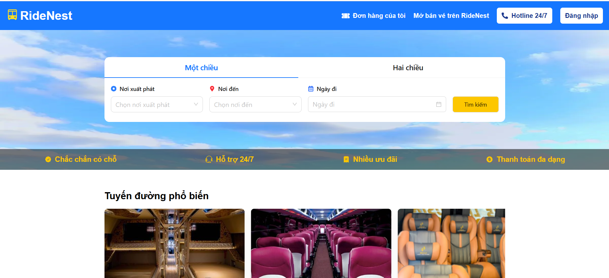

# Website đặt xe

Deploy: https://ridenest-booking.vercel.app/

## Công nghệ sử dụng
- Front-End: React.JS, Tailwind CSS
- Back-End: NodeJS(Express)
- Database: NoSQL(MongoDB)

## Các chức năng chính
- CRUD người dùng, xe, tuyến đường, 
- Chọn và đặt xe
- Chức năng tìm kiếm và lọc xe theo ngày tháng, tuyến đường
- Quản lý đơn đặt hàng
- Trang quản trị viên
- Giao diện responsive

## Tài khoản nhân viên
- Email: admin@gmail.com
- Password: 123456

## Khởi chạy dự án
npm run dev
